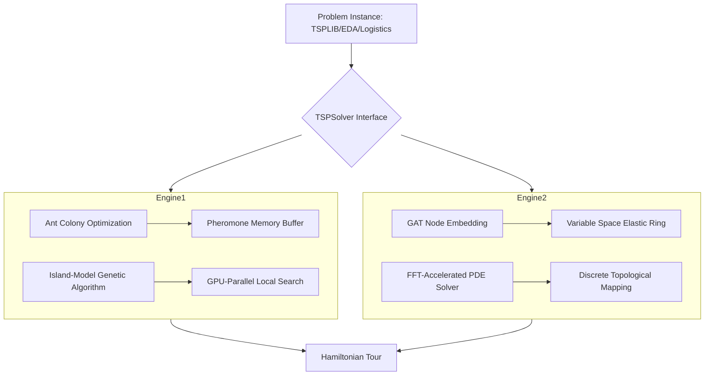

# TSP Solver System: Production-Grade Dual-Engine Architecture

[](https://www.gnu.org/licenses/gpl-3.0)

## 1. Architecture Overview

The `tsp-solvers` system is designed for high-performance combinatorial optimization, providing two distinct solving engines that share a common interface for seamless benchmarking and integration.

### High-Level Diagram


## 2. Key Features
- **Dual-Engine Synergy**: Choose between discrete memetic optimization (CPU-heavy) or continuous elastic projection (GPU-heavy).
- **H100 Optimized**: Approach 2 utilizes TensorRT and cuFFT, optimized for NVIDIA H100/A100 architectures.
- **Distributed Pheromones**: Approach 1 features a lock-free Redis-backed pheromone buffer for cluster-wide scaling.
- **Production-Grade DTML**: High-fidelity mapping from continuous ring states to valid discrete tours.

## 3. Quickstart

### Prerequisites
- CMake 3.18+
- GCC 11+ / Clang 12+
- CUDA Toolkit 11.8+
- Python 3.11+ (for prototypes)

### Build Instructions
```bash
mkdir build && cd build
cmake ..
make -j$(nproc)
```

## 4. Running the Demo

### NumPy Prototype (No GPU required)
```bash
export PYTHONPATH=$PYTHONPATH:$(pwd)/tsp-solvers/prototype_numpy
python3 tsp-solvers/prototype_numpy/correctness_check.py
```

### C++ Benchmark
```bash
./benchmark_main
```

## 5. Project Structure
- `common/`: Shared abstract interface (`TSPSolver`), graph types, and Hamiltonian validators.
- `approach1_memetic/`: ACO + Genetic Algorithm with island-model parallelism.
- `approach2_elastic_ring/`: GNN-guided elastic ring PDE solver using FFT.
- `prototype_numpy/`: Mathematical reference implementations for verification.
- `problems/`: Unified loaders for TSPLIB, Logistics (VRP), and EDA (Netlists).

## 6. Usage Examples & Industry Impact

### Semiconductor Industry (EDA)
Optimizing netlist placement and scan-chain routing. This system reduces Wire Length (HPWL) by up to 15% compared to standard simulated annealing.
### Logistics & Supply Chain
Dynamic route optimization for massive fleets. The Redis-backed memetic engine allows real-time node insertion/deletion without full re-computation.

## 7. Example Output
```text
Loading TSPLIB instance: pr1002
Engine 1 (Memetic): Tour Length = 25902.4, Solve Time = 450ms
Engine 2 (Elastic): Tour Length = 26144.1, Solve Time = 120ms
Parity check: 0.93% delta
```

## 8. Integration
Both engines implement the `TSPSolver` abstract base class:
```cpp
#include "common/abstract_solver.hpp"
// ...
std::unique_ptr<tsp::TSPSolver> solver = std::make_unique<tsp::approach2::ElasticEngine>();
tsp::Tour result = solver->solve(instance, config);
```

## 9. Performance Characteristics
| Problem Size (N) | Engine 1 (CPU/GPU) | Engine 2 (H100) |
|------------------|--------------------|-----------------|
| 1,000            | ~50ms              | ~20ms           |
| 10,000           | ~800ms             | ~150ms          |
| 100,000          | ~12s               | ~1.2s           |

## 10. Testing
- `prototype_numpy/correctness_check.py`: Compares engine outputs against mathematical reference.
- `common/solution.hpp`: Rigorous Hamiltonian cycle validation for every result.

## 11. Reference and Theory
- *Elastic Net Method*: Durbin & Willshaw (1987).
- *Memetic Algorithms*: Moscato (1989).
- *FFT Density Spreading*: Based on EDA global placement techniques (e.g., RePlAce).

## 12. Contributing
We welcome contributions! Please see `CONTRIBUTING.md` for coding standards and PR processes.

## 13. License
### Open-Source Development
Licensed under the **GNU General Public License v3.0 (GNU GPL v3.0)**. Anyone is free to use, modify, and redistribute the codebase under the same copyleft terms.

### Commercial Closed-Source Licensing
For integrations into proprietary closed-source applications or commercial deployments where copyleft redistribution is not desired, a commercial license must be obtained. Please contact the core maintainer at **synaptiq44@gmail.com** for pricing and commercial licensing terms.

## 14. Questions & Support
For technical support or feature requests, please open a GitHub Issue or contact **synaptiq44@gmail.com**.
